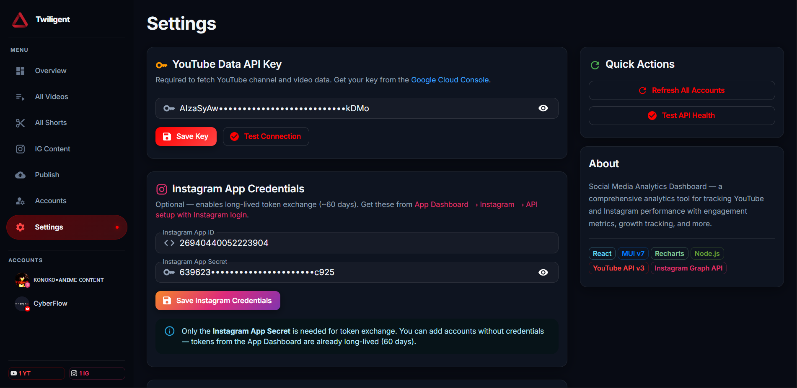

<div align="center">
  

  # Twiligent

  **Every analytics tool wants a subscription. And your data. I built Twiligent instead. YouTube stats. Instagram stats. One dashboard. Runs locally on your machine.**

  [](https://nodejs.org)
  [](https://react.dev)
  [](https://mui.com)
  [](LICENSE)
  [](CONTRIBUTING.md)

</div>

---

No third-party service sitting between you and your numbers. No monthly fee. No sending your data somewhere you can't see. You plug in your YouTube Data API and Instagram Graph API keys. It pulls everything. Displays it clean in a dark-themed dashboard. That's it. Your data stays yours.
The only time anything leaves your machine is when you schedule Instagram posts. That part runs through GitHub Actions. Everything else never moves Most people don't realize how much they're giving up just to see their own stats. This fixes that.

---

## Features

- **Multi-account support** — add unlimited YouTube channels and Instagram Business/Creator accounts side by side
- **YouTube analytics** — views, watch time, subscribers, revenue estimates, top videos, engagement rates, and shorts vs. long-form breakdown
- **Instagram analytics** — reach, impressions, follower growth, best day/hour to post, consistency score, and per-reel stats
- **Unified overview** — cross-platform totals and channel rankings at a glance
- **Content explorer** — sortable, filterable tables for all videos, all shorts, and all reels
- **Scheduled publishing** — schedule Instagram posts (image + caption + optional location) and let GitHub Actions publish them automatically every 15 minutes, even when your laptop is closed
- **Cloudinary support** — upload media directly from the dashboard to Cloudinary, then schedule or publish immediately
- **Token auto-refresh** — Instagram long-lived tokens refresh automatically every 24 hours so analytics never go stale
- **Zero database** — all data lives as JSON files in `backend/data/` for easy backup and full control

---

## Screenshots

<!-- Hero: Dashboard Overview -->
<div align="center">
  
  <p><em>Unified overview — cross-platform stats, audience comparison, and channel rankings at a glance</em></p>
</div>

<br/>

<!-- Row: YouTube + Instagram Analytics -->
<table width="100%">
  <tr>
    <td width="50%" align="center">
      
      <br/><sub><b>YouTube Channel Analytics</b> — 20+ metrics, top videos with thumbnails, engagement deep-dive</sub>
    </td>
    <td width="50%" align="center">
      
      <br/><sub><b>Instagram Account Analytics</b> — follower growth, best post times, consistency score, engagement timeline</sub>
    </td>
  </tr>
</table>

<br/>

<!-- Row: Content Explorers (3 columns) -->
<table width="100%">
  <tr>
    <td width="33%" align="center">
      
      <br/><sub><b>Video Explorer</b> — browse and sort all YouTube videos</sub>
    </td>
    <td width="33%" align="center">
      
      <br/><sub><b>Shorts Explorer</b> — dedicated view for YouTube Shorts</sub>
    </td>
    <td width="33%" align="center">
      
      <br/><sub><b>IG Content Explorer</b> — browse all reels and posts by performance</sub>
    </td>
  </tr>
</table>

<br/>

<!-- Row: Management pages (3 columns) -->
<table width="100%">
  <tr>
    <td width="33%" align="center">
      
      <br/><sub><b>Accounts</b> — add/remove YouTube channels and Instagram accounts</sub>
    </td>
    <td width="33%" align="center">
      
      <br/><sub><b>Publish</b> — upload to Cloudinary and schedule Instagram posts</sub>
    </td>
    <td width="33%" align="center">
      
      <br/><sub><b>Settings</b> — manage API keys and credentials in one place</sub>
    </td>
  </tr>
</table>

---

## Quick Start

### Prerequisites

| Tool | Minimum version |
|------|----------------|
| Node.js | 18 |
| npm | 9 |
| A YouTube Data API v3 key | — |
| An Instagram Graph API token | — |

### 1. Clone the repository

```bash
git clone https://github.com/your-username/twiligent.git
cd twiligent
```

### 2. Install dependencies

```bash
# Backend
cd backend && npm install

# Frontend (in a new terminal)
cd frontend && npm install
```

### 3. Configure API keys

Create `backend/data/api_keys.json`:

```json
{
  "youtubeApiKey": "YOUR_YOUTUBE_DATA_API_V3_KEY",
  "cloudinaryCloudName": "YOUR_CLOUDINARY_CLOUD_NAME",
  "cloudinaryApiKey": "YOUR_CLOUDINARY_API_KEY",
  "cloudinaryApiSecret": "YOUR_CLOUDINARY_API_SECRET"
}
```

> Instagram tokens are added per-account through the **Accounts** page in the UI — no manual JSON editing required.

### 4. Run

```bash
# Terminal 1 — backend (port 3001)
cd backend && npm run dev

# Terminal 2 — frontend (port 5173)
cd frontend && npm run dev
```

Open [http://localhost:5173](http://localhost:5173) in your browser.

---

## Why Twiligent?

Most analytics dashboards are either locked behind paywalls, share your data with third parties, or only support one platform. Twiligent is different:

- **Self-hosted** — your credentials and content data never leave your machine
- **Multi-platform** — YouTube and Instagram in one place, with a unified overview
- **Extensible** — every data source is a plain JSON file; every API call is a readable service module
- **Free to run** — uses only free API tiers and GitHub Actions free minutes (unlimited on public repos)

---

## Getting Your API Keys

### YouTube Data API v3

1. Go to [Google Cloud Console](https://console.cloud.google.com/)
2. Create a project → **APIs & Services** → **Library** → search "YouTube Data API v3" → **Enable**
3. **Credentials** → **Create Credentials** → **API key**
4. (Optional) Restrict the key to the YouTube Data API v3 for security
5. Paste the key into `backend/data/api_keys.json`

### Instagram Graph API

Instagram requires a Business or Creator account linked to a Facebook Page.

1. Go to [Meta for Developers](https://developers.facebook.com/) → create an app of type **Business**
2. Add the **Instagram Graph API** product
3. Generate a **User Access Token** with scopes:
   - `instagram_basic`
   - `instagram_manage_insights`
   - `pages_read_engagement`
4. Exchange it for a **Long-Lived Token** (valid 60 days — Twiligent auto-refreshes it)
5. In the Twiligent **Accounts** page, click **Add Instagram Account** and paste the token

### Cloudinary (optional — required for scheduled publishing)

1. Sign up at [cloudinary.com](https://cloudinary.com) (free tier: 25 GB storage, 25 GB bandwidth/month)
2. Copy your **Cloud name**, **API Key**, and **API Secret** from the Cloudinary dashboard
3. Paste them into `backend/data/api_keys.json`

---

## Scheduled Publishing with GitHub Actions

Twiligent uses a GitHub Actions workflow to publish scheduled Instagram posts even when your machine is offline. The workflow runs every 15 minutes on GitHub's servers.

### Setup

**Step 1 — Push your repo to GitHub** (the `backend/data/accounts.json` file is gitignored to protect tokens)

**Step 2 — Add the accounts secret**

```bash
# macOS / Linux
cat backend/data/accounts.json | base64

# Windows PowerShell
[Convert]::ToBase64String([IO.File]::ReadAllBytes("backend\data\accounts.json"))
```

Go to your GitHub repo → **Settings** → **Secrets and variables** → **Actions** → **New repository secret**:

| Name | Value |
|------|-------|
| `ACCOUNTS_JSON` | The base64 string from above |

**Step 3 — Enable Actions**

Go to your repo → **Actions** → enable workflows if prompted. The `Instagram Scheduled Publisher` workflow will trigger automatically on the cron schedule.

> **Free tier note:** Public repos get unlimited GitHub Actions minutes. Private repos get 2,000 min/month — change the cron to `'*/30 * * * *'` in `.github/workflows/publish-scheduled.yml` to stay within the limit.

### How it works

1. You schedule a post through the **Publish** page in the UI
2. The post is saved to `backend/data/scheduled_posts.json` and synced to GitHub via the Contents API
3. Every 15 minutes, the GitHub Actions workflow checks for due posts
4. Due posts are published to Instagram via the Graph API
5. The workflow commits the updated `scheduled_posts.json` back to the repo (status changed to `published`)
6. Next time your backend starts, it pulls the latest `scheduled_posts.json` from GitHub

---

## Project Structure

```
twiligent/
├── backend/
│   ├── data/                      # JSON data files (gitignored: accounts.json)
│   │   ├── api_keys.json          # API credentials
│   │   ├── scheduled_posts.json   # Post schedule (synced via GitHub API)
│   │   ├── videos_cache.json      # YouTube video cache
│   │   └── ig_cache.json          # Instagram analytics cache
│   ├── routes/                    # Express route handlers
│   │   ├── accounts.js            # Add/remove/refresh accounts
│   │   ├── analytics.js           # Fetch channel analytics
│   │   ├── publishing.js          # Publish content to Instagram
│   │   ├── scheduledPosts.js      # CRUD for scheduled posts
│   │   ├── github.js              # GitHub sync endpoints
│   │   └── keys.js                # API key management
│   ├── services/                  # External API clients
│   │   ├── youtube.js             # YouTube Data API v3 integration
│   │   └── instagram.js           # Instagram Graph API integration
│   ├── utils/
│   │   ├── dataHelpers.js         # JSON read/write utilities
│   │   └── scheduler.js           # Due-post processing logic
│   └── server.js                  # Express entry point
│
├── frontend/
│   ├── public/
│   │   └── logo.png               # App logo
│   └── src/
│       ├── features/              # Feature-based modules
│       │   ├── analytics/
│       │   │   ├── overview/      # Unified cross-platform overview
│       │   │   ├── channel/       # YouTube channel deep-dive
│       │   │   ├── videos/        # All videos explorer
│       │   │   ├── shorts/        # All shorts explorer
│       │   │   ├── instagram/     # Instagram account analytics
│       │   │   └── reels/         # Reels / IG content explorer
│       │   ├── accounts/          # Account management UI
│       │   ├── publishing/        # Content upload + scheduler
│       │   └── settings/          # App settings
│       ├── layouts/
│       │   └── Sidebar.jsx        # Navigation sidebar
│       ├── components/ui/         # Shared UI components
│       │   ├── StatCard.jsx       # Metric card with gradient icon
│       │   └── Logo.jsx           # App logo component
│       ├── services/
│       │   └── api.js             # Frontend API client
│       ├── utils/
│       │   └── formatters.js      # Number / date formatters
│       ├── theme.js               # MUI dark theme
│       └── App.jsx                # Root component + routing
│
├── scripts/
│   └── publish-scheduled.js       # GitHub Actions post publisher
│
├── .github/
│   └── workflows/
│       └── publish-scheduled.yml  # Cron workflow (every 15 min)
│
└── README.md
```

---

## Contributing

Pull requests are welcome. For major changes, open an issue first to discuss what you'd like to change.

1. Fork the repository
2. Create a feature branch: `git checkout -b feature/your-feature`
3. Commit your changes: `git commit -m 'Add your feature'`
4. Push to the branch: `git push origin feature/your-feature`
5. Open a pull request

Please keep pull requests focused — one feature or fix per PR.

---

## License

[MIT](LICENSE)

---

<div align="center">
  Built with Express, React, and the YouTube + Instagram Graph APIs.
</div>
