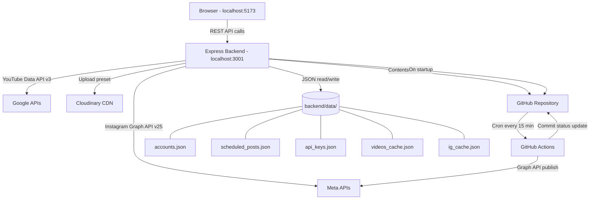

<div align="center">

  

  <h1>Twiligent</h1>

  <p><strong>A self-hosted analytics and publishing dashboard for YouTube and Instagram.<br/>Your data. Your machine. No subscriptions.</strong></p>

  <p>
    <a href="https://nodejs.org"></a>
    <a href="https://react.dev"></a>
    <a href="https://vitejs.dev"></a>
    <a href="https://tailwindcss.com"></a>
    <a href="LICENSE"></a>
  </p>

  <br/>

  

  <br/>
  <sub>Dashboard overview tracking YouTube and Instagram accounts side by side</sub>

</div>

---

## What is Twiligent?

Every analytics product wants a monthly subscription and access to your data. Twiligent is the alternative: a local-first dashboard that pulls your YouTube and Instagram stats directly from their official APIs, displays them in one place, and keeps everything on your machine.

No data leaves your computer except when you schedule an Instagram post through GitHub Actions. No accounts created on a third-party service. No ongoing cost beyond free API tiers.

---

## Table of Contents

- [Features](#features)
- [Screenshots](#screenshots)
- [Quick Start](#quick-start)
- [Prerequisites](#prerequisites)
- [Installation](#installation)
- [API Keys Setup](#api-keys-setup)
- [Scheduled Publishing with GitHub Actions](#scheduled-publishing-with-github-actions)
- [How It Works](#how-it-works)
- [Project Structure](#project-structure)
- [Tech Stack](#tech-stack)
- [Contributing](#contributing)
- [License](#license)

---

## Features

| Feature | Details |
|---|---|
| **Multi-account support** | Add unlimited YouTube channels and Instagram Business or Creator accounts |
| **YouTube analytics** | Views, subscribers, likes, comments, engagement rate, avg views per video, Shorts vs. long-form breakdown, top videos, Tags and SEO analysis |
| **Instagram analytics** | Followers, engagement rate, virality score, consistency score, best posting day and hour, content-type performance, hashtag analysis, caption-length correlation |
| **Unified overview** | Cross-platform totals, audience comparison chart, audience share pie, leaderboards |
| **Content explorers** | Sortable and filterable grids for all YouTube Videos, all YouTube Shorts, and all Instagram Reels and posts |
| **Scheduled publishing** | Schedule Instagram photos, Reels, and Stories; GitHub Actions publishes them every 15 minutes even when your machine is offline |
| **Bulk upload** | Upload multiple files at once, assign captions individually or apply a shared caption, schedule them with configurable intervals |
| **Cloudinary CDN** | Upload media directly from the dashboard; Instagram requires public URLs before publishing |
| **Token auto-refresh** | Instagram long-lived tokens renew automatically every 24 hours so analytics never break |
| **Zero database** | All data lives in plain JSON files under `backend/data/` for easy backup and full control |
| **Dark and light mode** | Toggle between themes from the header |

---

## Screenshots

<table width="100%">
  <tr>
    <td width="50%" align="center">
      
      <br/><sub><strong>YouTube Channel Analytics</strong> - 20+ metrics across 8 tabs including Overview, Videos, Engagement, Content, Publishing, Growth, Shorts vs Regular, and Tags and SEO</sub>
    </td>
    <td width="50%" align="center">
      
      <br/><sub><strong>Instagram Account Analytics</strong> - follower stats, engagement timeline, best posting times, consistency score, and virality score</sub>
    </td>
  </tr>
</table>

<br/>

<table width="100%">
  <tr>
    <td width="33%" align="center">
      
      <br/><sub><strong>Video Explorer</strong> - browse, search, and sort all YouTube videos with thumbnail previews and per-video stats</sub>
    </td>
    <td width="33%" align="center">
      
      <br/><sub><strong>Shorts Explorer</strong> - dedicated grid view for YouTube Shorts with performance filtering</sub>
    </td>
    <td width="33%" align="center">
      
      <br/><sub><strong>IG Content Explorer</strong> - browse all reels, photos, and carousels sorted by likes, comments, or engagement</sub>
    </td>
  </tr>
</table>

<br/>

<table width="100%">
  <tr>
    <td width="33%" align="center">
      
      <br/><sub><strong>Accounts</strong> - add and remove YouTube channels and Instagram accounts; view live stats at a glance</sub>
    </td>
    <td width="33%" align="center">
      
      <br/><sub><strong>Publish</strong> - upload to Cloudinary, schedule or publish immediately, single or bulk mode</sub>
    </td>
    <td width="33%" align="center">
      
      <br/><sub><strong>Settings</strong> - manage YouTube API key, Instagram App credentials, and Cloudinary config in one place</sub>
    </td>
  </tr>
</table>

---

## Quick Start

Three steps to get running:

```bash
git clone https://github.com/spacesdrive/twiligent.git
cd twiligent/backend && npm install
cd ../frontend && npm install
```

Then start both servers:

```bash
# Terminal 1 - backend (port 3001)
cd backend && npm run dev

# Terminal 2 - frontend (port 5173)
cd frontend && npm run dev
```

Open [http://localhost:5173](http://localhost:5173), go to **Settings**, paste your YouTube API key, and add your first account.

---

## Prerequisites

| Requirement | Minimum version | Notes |
|---|---|---|
| Node.js | 18 | 20 recommended |
| npm | 9 | included with Node.js |
| YouTube Data API v3 key | - | required for YouTube analytics |
| Instagram Graph API token | - | required for Instagram analytics |
| Cloudinary account | - | optional; required for content publishing |
| GitHub repository | - | optional; required for scheduled publishing |

---

## Installation

**1. Clone the repository**

```bash
git clone https://github.com/spacesdrive/twiligent.git
cd twiligent
```

**2. Install backend dependencies**

```bash
cd backend && npm install
```

**3. Install frontend dependencies**

```bash
cd frontend && npm install
```

**4. Start the development servers**

```bash
# Terminal 1
cd backend && npm run dev

# Terminal 2
cd frontend && npm run dev
```

The backend runs on port 3001. The frontend runs on port 5173. Open [http://localhost:5173](http://localhost:5173).

All API keys are configured through the Settings page in the UI. No manual file editing required after initial clone.

---

## API Keys Setup

### YouTube Data API v3

1. Open [Google Cloud Console](https://console.cloud.google.com/) and create a new project
2. Navigate to **APIs and Services** then **Library**, search for "YouTube Data API v3", and enable it
3. Go to **Credentials**, click **Create Credentials**, and select **API key**
4. Optionally restrict the key to the YouTube Data API v3 for security
5. Copy the key and paste it into the **Settings** page inside Twiligent

### Instagram Graph API

Instagram requires a Business or Creator account linked to a Facebook Page.

1. Go to [Meta for Developers](https://developers.facebook.com/) and create an app of type **Business**
2. Add the **Instagram Graph API** product to your app
3. Generate a User Access Token with the following permissions:
   - `instagram_business_basic`
   - `instagram_business_manage_insights`
   - `instagram_business_content_publish` (required for publishing)
4. The token from the App Dashboard is already long-lived (60 days). Twiligent auto-refreshes it before expiry.
5. In Twiligent, go to **Accounts**, click **Add Instagram Account**, and paste the token

**Optional:** Save your Instagram App ID and App Secret in **Settings** to enable automatic short-to-long-lived token exchange when adding accounts.

### Cloudinary (required for publishing only)

1. Sign up at [cloudinary.com](https://cloudinary.com) (free tier: 25 GB storage, 25 GB bandwidth per month)
2. From the Cloudinary dashboard, copy your **Cloud name**, **API Key**, and **API Secret**
3. Create an **unsigned upload preset** in Cloudinary (Settings then Upload then Upload presets)
4. Paste all four values into the Cloudinary section of Twiligent Settings

---

## Scheduled Publishing with GitHub Actions

Twiligent uses a GitHub Actions workflow to publish scheduled Instagram posts every 15 minutes. Posts publish on time even when your machine is offline.

### How scheduling works

1. You schedule a post through the **Publish** page (photo, reel, or story with caption and optional metadata)
2. The post is saved locally to `backend/data/scheduled_posts.json` and synced to your GitHub repo via the Contents API
3. The GitHub Actions workflow runs on a 15-minute cron and checks for due posts
4. Due posts are published to Instagram via the Graph API using your stored token
5. The workflow commits the updated `scheduled_posts.json` back to the repo with status changed to `published`
6. When your backend starts next time, it pulls the latest status from GitHub

### Setup

**Step 1 - Push your repo to GitHub**

The `backend/data/accounts.json` file is gitignored automatically to protect your tokens.

**Step 2 - Encode your accounts file**

```bash
# macOS or Linux
cat backend/data/accounts.json | base64

# Windows PowerShell
[Convert]::ToBase64String([IO.File]::ReadAllBytes("backend\data\accounts.json"))
```

**Step 3 - Add the repository secret**

Go to your GitHub repo, then **Settings**, then **Secrets and variables**, then **Actions**, then **New repository secret**:

| Name | Value |
|---|---|
| `ACCOUNTS_JSON` | The base64 string from Step 2 |

**Step 4 - Enable Actions**

Go to your repo then **Actions** and enable workflows if prompted. The `Instagram Scheduled Publisher` workflow starts automatically on the cron schedule.

**Free tier note:** Public repos get unlimited GitHub Actions minutes. For private repos (2,000 min per month limit), change the cron in `.github/workflows/publish-scheduled.yml` from `*/15` to `*/30` to stay within limits.

---

## How It Works


```mermaid
flowchart TD
    A[Browser - localhost:5173] -->|REST API calls| B[Express Backend - localhost:3001]
    B -->|YouTube Data API v3| C[Google APIs]
    B -->|Instagram Graph API v25| D[Meta APIs]
    B -->|Upload preset| E[Cloudinary CDN]
    B -->|Contents API| F[GitHub Repository]
    F -->|Cron every 15 min| G[GitHub Actions]
    G -->|Graph API publish| D
    G -->|Commit status update| F
    B -->|On startup| F
    B -->|JSON read/write| H[(backend/data/)]
    H --- H1[accounts.json]
    H --- H2[scheduled_posts.json]
    H --- H3[api_keys.json]
    H --- H4[videos_cache.json]
    H --- H5[ig_cache.json]
```

**Backend startup sequence:**

1. Initialize JSON data files if they do not exist
2. Pull latest `scheduled_posts.json` from GitHub to sync any posts published while offline
3. Check for overdue pending posts and publish them immediately
4. Start the 60-second scheduler loop for upcoming posts
5. Start the 24-hour Instagram token auto-refresh cycle
6. Remove `accounts.json` from GitHub if it was accidentally committed

---

## Project Structure

```
twiligent/
├── .github/
│   └── workflows/
│       └── publish-scheduled.yml    # Cron workflow (every 15 minutes)
│
├── backend/
│   ├── data/                        # JSON storage (accounts.json is gitignored)
│   │   ├── api_keys.json            # API credentials
│   │   ├── scheduled_posts.json     # Post queue synced via GitHub API
│   │   ├── videos_cache.json        # YouTube video analytics cache
│   │   └── ig_cache.json            # Instagram media cache
│   ├── routes/
│   │   ├── accounts.js              # Add, remove, and refresh accounts
│   │   ├── analytics.js             # Fetch YouTube and Instagram analytics
│   │   ├── publishing.js            # Publish content to Instagram Graph API
│   │   ├── scheduledPosts.js        # CRUD for the post schedule
│   │   ├── github.js                # GitHub sync and pull endpoints
│   │   └── keys.js                  # API key management
│   ├── services/
│   │   ├── youtube.js               # YouTube Data API v3 client
│   │   ├── instagram.js             # Instagram Graph API client with retry and timeout
│   │   └── github.js                # GitHub Contents API and Actions Secrets client
│   ├── utils/
│   │   ├── dataHelpers.js           # JSON file read and write utilities
│   │   └── scheduler.js             # Due-post detection and publish loop
│   └── server.js                    # Express entry point
│
├── frontend/
│   └── src/
│       ├── features/
│       │   ├── analytics/
│       │   │   ├── overview/        # Unified cross-platform dashboard
│       │   │   ├── channel/         # YouTube channel deep-dive (8 tabs)
│       │   │   ├── instagram/       # Instagram account analytics
│       │   │   ├── videos/          # All videos explorer
│       │   │   ├── shorts/          # YouTube Shorts explorer
│       │   │   └── reels/           # Instagram content explorer
│       │   ├── accounts/            # Account management UI
│       │   ├── publishing/          # Single and bulk upload with scheduler
│       │   └── settings/            # API key configuration
│       ├── layout/
│       │   ├── Sidebar.jsx          # Collapsible navigation sidebar
│       │   └── Header.jsx           # Breadcrumbs, refresh, theme toggle
│       ├── components/ui/           # shadcn/ui components and custom primitives
│       ├── context/
│       │   └── AppContext.jsx       # Global accounts and loading state
│       └── services/
│           └── api.js               # Typed frontend API client
│
└── scripts/
    └── publish-scheduled.js         # Node.js script run by GitHub Actions
```

---

## Tech Stack

**Frontend**

| Library | Version | Purpose |
|---|---|---|
| React | 19 | UI framework |
| Vite | 7 | Build tool and dev server |
| Tailwind CSS | 4 | Utility-first styling via CSS variables |
| shadcn/ui (base-nova) | latest | Component library built on Base UI |
| Recharts | 3 | Charts and data visualization |
| React Router | 7 | Client-side routing with lazy loading |
| next-themes | 0.4 | Dark and light mode toggling |
| Lucide React | 1.17 | Icon library |
| Sonner | 2 | Toast notifications |

**Backend**

| Library | Version | Purpose |
|---|---|---|
| Express | 4 | HTTP server and routing |
| node-fetch | 2 | HTTP client for external APIs |
| libsodium-wrappers | latest | Encrypts GitHub Actions secrets |
| nodemon | latest | Development server with hot reload |

**Infrastructure**

| Service | Purpose |
|---|---|
| YouTube Data API v3 | Channel and video analytics |
| Instagram Graph API v25 | Account analytics and content publishing |
| Cloudinary | Media CDN (Instagram requires public URLs) |
| GitHub Contents API | Syncing scheduled posts across devices |
| GitHub Actions | Cloud-based cron publishing (free tier) |

---

## Why Twiligent?

Most analytics tools share one or more of these problems:

- They charge monthly subscriptions for data you already own
- They only support one platform, forcing you to switch between dashboards
- They require you to authorize a third-party service with access to your accounts
- They lock historical data behind higher tiers

Twiligent is different on each point:

- **Free to run.** Uses only free API tiers and GitHub Actions free minutes
- **Multi-platform.** YouTube and Instagram in one unified view
- **Self-hosted.** Your credentials and cached data never leave your machine
- **Open and auditable.** Every API call is a readable service module; all data is a plain JSON file you can open in any editor

---

## Contributing

Contributions are welcome. For significant changes, open an issue first to discuss the approach.

1. Fork the repository from [github.com/spacesdrive/twiligent](https://github.com/spacesdrive/twiligent)
2. Create a feature branch

```bash
git checkout -b feature/your-feature-name
```

3. Make your changes and commit

```bash
git commit -m "feat: add your feature description"
```

4. Push and open a pull request

```bash
git push origin feature/your-feature-name
```

Please keep pull requests focused: one feature or fix per PR. Avoid unrelated refactors in the same change.

---

## License

[MIT](LICENSE)

---

<div align="center">
  <sub>Built with Express, React 19, Tailwind CSS v4, and the YouTube Data and Instagram Graph APIs.</sub>
</div>
