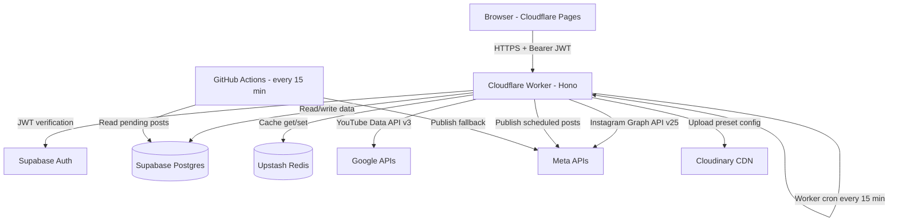

<div align="center">

  

  <h1>Twiligent</h1>

  <p><strong>A self-hosted analytics and publishing dashboard for YouTube and Instagram.<br/>Your data. Your infrastructure. No subscriptions.</strong></p>

  <p>
    <a href="https://react.dev"></a>
    <a href="https://vitejs.dev"></a>
    <a href="https://tailwindcss.com"></a>
    <a href="https://hono.dev"></a>
    <a href="https://workers.cloudflare.com"></a>
    <a href="LICENSE"></a>
  </p>

  <br/>

  

  <br/>
  <sub>Dashboard overview tracking YouTube and Instagram accounts side by side</sub>

</div>

---

## What is Twiligent?

Every analytics product wants a monthly subscription and access to your data. Twiligent is the alternative: a self-hosted dashboard that pulls your YouTube and Instagram stats directly from their official APIs, displays them in one place, and runs entirely on infrastructure you control.

You deploy one Cloudflare Worker and one Cloudflare Pages site using your own API credentials. Your data is stored in your own Supabase database and cached in your own Upstash Redis instance. No shared infrastructure. No accounts created on third-party services beyond the free tiers you choose. No ongoing cost.

---

## Table of Contents

- [Features](#features)
- [Screenshots](#screenshots)
- [Quick Start](#quick-start)
- [Prerequisites](#prerequisites)
- [Installation](#installation)
- [Configuration](#configuration)
- [Scheduled Publishing with GitHub Actions](#scheduled-publishing-with-github-actions)
- [How It Works](#how-it-works)
- [Project Structure](#project-structure)
- [Tech Stack](#tech-stack)
- [Contributing](#contributing)
- [License](#license)

---

## Features

| Feature | Details |
|---|---|
| **Multi-account support** | Add unlimited YouTube channels and Instagram Business or Creator accounts |
| **YouTube analytics** | Views, subscribers, likes, comments, engagement rate, avg views per video, Shorts vs. long-form breakdown, top videos, Tags and SEO analysis |
| **Instagram analytics** | Followers, engagement rate, virality score, consistency score, best posting day and hour, content-type performance, hashtag analysis, caption-length correlation |
| **Unified overview** | Cross-platform totals, audience comparison chart, audience share pie, leaderboards |
| **Content explorers** | Sortable and filterable grids for all YouTube Videos, all YouTube Shorts, and all Instagram Reels and posts |
| **Scheduled publishing** | Schedule Instagram photos, Reels, and Stories; a Cloudflare Worker cron publishes them every 15 minutes automatically |
| **Bulk upload** | Upload multiple files at once, assign captions individually or apply a shared caption, schedule them with configurable intervals |
| **Cloudinary CDN** | Upload media directly from the dashboard; Instagram requires public URLs before publishing |
| **Token auto-refresh** | Instagram long-lived tokens renew automatically every 24 hours via a daily Worker cron so analytics never break |
| **Authentication** | Supabase Auth with email and password; each user's accounts and posts are fully isolated |
| **Dark and light mode** | Toggle between themes from the header |

---

## Screenshots

<table width="100%">
  <tr>
    <td width="50%" align="center">
      
      <br/><sub><strong>YouTube Channel Analytics</strong> - 20+ metrics across 8 tabs including Overview, Videos, Engagement, Content, Publishing, Growth, Shorts vs Regular, and Tags and SEO</sub>
    </td>
    <td width="50%" align="center">
      
      <br/><sub><strong>Instagram Account Analytics</strong> - follower stats, engagement timeline, best posting times, consistency score, and virality score</sub>
    </td>
  </tr>
</table>

<br/>

<table width="100%">
  <tr>
    <td width="33%" align="center">
      
      <br/><sub><strong>Video Explorer</strong> - browse, search, and sort all YouTube videos with thumbnail previews and per-video stats</sub>
    </td>
    <td width="33%" align="center">
      
      <br/><sub><strong>Shorts Explorer</strong> - dedicated grid view for YouTube Shorts with performance filtering</sub>
    </td>
    <td width="33%" align="center">
      
      <br/><sub><strong>IG Content Explorer</strong> - browse all reels, photos, and carousels sorted by likes, comments, or engagement</sub>
    </td>
  </tr>
</table>

<br/>

<table width="100%">
  <tr>
    <td width="33%" align="center">
      
      <br/><sub><strong>Accounts</strong> - add and remove YouTube channels and Instagram accounts; view live stats at a glance</sub>
    </td>
    <td width="33%" align="center">
      
      <br/><sub><strong>Publish</strong> - upload to Cloudinary, schedule or publish immediately, single or bulk mode</sub>
    </td>
    <td width="33%" align="center">
      
      <br/><sub><strong>Settings</strong> - configure your GitHub PAT and repository for the scheduled post fallback publisher</sub>
    </td>
  </tr>
</table>

---

## Quick Start

Clone and install dependencies:

```bash
git clone https://github.com/spacesdrive/twiligent.git
cd twiligent/backend && npm install
cd ../frontend && npm install
```

Create `backend/.dev.vars` with your credentials (see [Configuration](#configuration)), then start both servers:

```bash
# Terminal 1 - backend (port 8787)
cd backend && wrangler dev

# Terminal 2 - frontend (port 5173)
cd frontend && npm run dev
```

Open [http://localhost:5173](http://localhost:5173) and sign up for an account, then go to **Accounts** to add your first YouTube channel or Instagram account.

---

## Prerequisites

| Requirement | Notes |
|---|---|
| Node.js 20 | Required for Wrangler CLI |
| Wrangler CLI | `npm install -g wrangler`, then `wrangler login` |
| Cloudflare account | Free tier sufficient for Workers and Pages |
| Supabase project | Free tier sufficient; create at [supabase.com](https://supabase.com) |
| YouTube Data API v3 key | Required for YouTube analytics |
| Instagram Graph API | Meta app of type Business required |
| Cloudinary account | Required for content publishing only |

---

## Installation

**1. Clone the repository**

```bash
git clone https://github.com/spacesdrive/twiligent.git
cd twiligent
```

**2. Install dependencies**

```bash
cd backend && npm install
cd ../frontend && npm install
```

**3. Create the Supabase database tables**

In your Supabase project, open the SQL editor and run the following:

```sql
-- Accounts table
create table accounts (
  id text primary key,
  user_id uuid not null references auth.users(id) on delete cascade,
  platform text not null,
  data jsonb not null
);

-- Settings table
create table settings (
  user_id uuid not null references auth.users(id) on delete cascade,
  key text not null,
  value jsonb,
  primary key (user_id, key)
);

-- Scheduled posts table
create table scheduled_posts (
  id text primary key,
  user_id uuid not null references auth.users(id) on delete cascade,
  account_id text not null references accounts(id) on delete cascade,
  status text not null default 'pending',
  scheduled_at timestamptz not null,
  data jsonb
);
```

**4. Configure credentials**

See [Configuration](#configuration) below.

**5. Start the development servers**

```bash
# Terminal 1
cd backend && wrangler dev

# Terminal 2
cd frontend && npm run dev
```

The backend runs on port 8787. The frontend runs on port 5173. Open [http://localhost:5173](http://localhost:5173).

---

## Configuration

### Local development (`backend/.dev.vars`)

Create `backend/.dev.vars` (this file is gitignored):

```
SUPABASE_URL=https://your-project.supabase.co
SUPABASE_SERVICE_KEY=eyJhbGciOiJIUzI1NiIsInR5cCI6IkpXVCJ9...
SUPABASE_ANON_KEY=eyJhbGciOiJIUzI1NiIsInR5cCI6IkpXVCJ9...
YOUTUBE_API_KEY=AIzaSy...
INSTAGRAM_APP_ID=123456789
INSTAGRAM_APP_SECRET=abc123...
CLOUDINARY_CLOUD_NAME=mycloud
CLOUDINARY_UPLOAD_PRESET=ml_default
BACKEND_URL=http://localhost:8787
FRONTEND_URL=http://localhost:5173
UPSTASH_REDIS_REST_URL=https://...
UPSTASH_REDIS_REST_TOKEN=...
```

`UPSTASH_REDIS_REST_URL` and `UPSTASH_REDIS_REST_TOKEN` are optional. The app works without Redis - analytics are fetched live on every request with caching disabled.

### Frontend environment variables (`frontend/.env.local`)

```
VITE_SUPABASE_URL=https://your-project.supabase.co
VITE_SUPABASE_ANON_KEY=eyJhbGciOiJIUzI1NiIsInR5cCI6IkpXVCJ9...
VITE_API_URL=http://localhost:8787
```

### Production (Cloudflare Workers secrets)

Set each secret via Wrangler:

```bash
wrangler secret put SUPABASE_URL
wrangler secret put SUPABASE_SERVICE_KEY
wrangler secret put SUPABASE_ANON_KEY
wrangler secret put YOUTUBE_API_KEY
wrangler secret put INSTAGRAM_APP_ID
wrangler secret put INSTAGRAM_APP_SECRET
wrangler secret put CLOUDINARY_CLOUD_NAME
wrangler secret put CLOUDINARY_UPLOAD_PRESET
wrangler secret put BACKEND_URL
wrangler secret put FRONTEND_URL
wrangler secret put UPSTASH_REDIS_REST_URL
wrangler secret put UPSTASH_REDIS_REST_TOKEN
```

### Getting API credentials

**YouTube Data API v3**

1. Open [Google Cloud Console](https://console.cloud.google.com/) and create a new project
2. Navigate to **APIs and Services** then **Library**, search for "YouTube Data API v3", and enable it
3. Go to **Credentials**, click **Create Credentials**, and select **API key**
4. Optionally restrict the key to the YouTube Data API v3 for security
5. Set it as `YOUTUBE_API_KEY`

**Instagram Graph API**

Instagram requires a Business or Creator account linked to a Facebook Page.

1. Go to [Meta for Developers](https://developers.facebook.com/) and create an app of type **Business**
2. Add the **Instagram Graph API** product to your app
3. Note your **App ID** and **App Secret** from the app's Basic Settings
4. Set `INSTAGRAM_APP_ID` and `INSTAGRAM_APP_SECRET`
5. In Twiligent, go to **Accounts** and use the **Connect Instagram** flow to authorize accounts via OAuth

**Cloudinary (required for publishing only)**

1. Sign up at [cloudinary.com](https://cloudinary.com) (free tier: 25 GB storage, 25 GB bandwidth per month)
2. From the Cloudinary dashboard, copy your **Cloud name**
3. Create an **unsigned upload preset** in Cloudinary (Settings then Upload then Upload presets)
4. Set `CLOUDINARY_CLOUD_NAME` and `CLOUDINARY_UPLOAD_PRESET`

---

## Scheduled Publishing with GitHub Actions

Twiligent uses a dual-scheduler approach to publish Instagram posts reliably:

1. **Primary:** The Cloudflare Worker has a built-in cron trigger that fires every 15 minutes. No setup required - it runs automatically once the Worker is deployed.
2. **Fallback:** A GitHub Actions workflow (`publish-scheduled.yml`) also runs every 15 minutes. It serves as a backup in case the Worker cron misses a cycle.

Both schedulers write to the same `scheduled_posts` table in Supabase. A `publishing` status flag acts as a mutex to prevent the same post from being published twice.

### How scheduling works

1. You schedule a post through the **Publish** page (photo, reel, or story with caption and optional metadata)
2. The post is saved to Supabase with `status: 'pending'` and a `scheduled_at` timestamp
3. The Worker cron fires every 15 minutes, queries for due posts, and publishes them via the Instagram Graph API
4. Each post is marked `publishing` before the API call and `published` or `failed` after
5. The GitHub Actions workflow runs the same logic as a redundant fallback

### Setup (GitHub Actions fallback only)

The Cloudflare Worker cron requires no additional setup. To enable the GitHub Actions fallback:

**Step 1 - Add repository secrets**

Go to your GitHub repo, then **Settings**, then **Secrets and variables**, then **Actions**, then **New repository secret**:

| Name | Value |
|---|---|
| `SUPABASE_URL` | Your Supabase project URL |
| `SUPABASE_SERVICE_KEY` | Your Supabase service role key |

**Step 2 - Enable Actions**

Go to your repo then **Actions** and enable workflows if prompted. The `Instagram Scheduled Publisher` workflow starts automatically on the cron schedule.

**Free tier note:** Public repos get unlimited GitHub Actions minutes. For private repos (2,000 min per month limit), change the cron in `.github/workflows/publish-scheduled.yml` from `*/15` to `*/30` to stay within limits.

---

## How It Works


```mermaid
flowchart TD
    A[Browser - Cloudflare Pages] -->|HTTPS + Bearer JWT| B[Cloudflare Worker - Hono]
    B -->|JWT verification| C[Supabase Auth]
    B -->|Read/write data| D[(Supabase Postgres)]
    B -->|Cache get/set| E[(Upstash Redis)]
    B -->|YouTube Data API v3| F[Google APIs]
    B -->|Instagram Graph API v25| G[Meta APIs]
    B -->|Upload preset config| H[Cloudinary CDN]
    B -->|Worker cron every 15 min| B
    B -->|Publish scheduled posts| G
    I[GitHub Actions - every 15 min] -->|Read pending posts| D
    I -->|Publish fallback| G
```

**Request lifecycle:**

1. The browser sends a request with a Supabase JWT in the `Authorization: Bearer` header
2. The Cloudflare Worker verifies the JWT and extracts the user ID
3. Route handlers query Supabase using the verified user ID as an isolation filter
4. Frequently accessed data (analytics) is read from Upstash Redis if available; otherwise fetched live from the platform APIs and cached
5. Responses are returned as JSON; access tokens are always stripped before leaving the Worker

**Cron lifecycle:**

1. The Cloudflare scheduler fires the Worker on a `*/15 * * * *` cron
2. The Worker queries `scheduled_posts` for rows with `status = 'pending'` and `scheduled_at <= now()`
3. Each due post is set to `publishing` (mutex), published to Instagram, then set to `published` or `failed`
4. A separate `0 0 * * *` cron refreshes expiring Instagram access tokens across all users

---

## Project Structure

```
twiligent/
├── .github/
│   └── workflows/
│       ├── deploy-backend.yml       # Wrangler deploy on backend changes
│       ├── deploy-frontend.yml      # Cloudflare Pages deploy on frontend changes
│       └── publish-scheduled.yml    # Scheduled post fallback (every 15 minutes)
│
├── backend/
│   ├── lib/
│   │   ├── db.js                    # All Supabase query functions (single source)
│   │   ├── cache.js                 # Redis cache helpers (silent fail on error)
│   │   ├── redis.js                 # Upstash Redis client factory
│   │   └── supabase.js              # Supabase client factory
│   ├── middleware/
│   │   └── auth.js                  # requireAuth: JWT verification, sets userId
│   ├── routes/
│   │   ├── accounts.js              # Add, remove, and refresh accounts
│   │   ├── analytics.js             # YouTube and Instagram analytics
│   │   ├── publishing.js            # Instagram Graph API publish flow
│   │   ├── scheduledPosts.js        # CRUD for scheduled post queue
│   │   ├── instagramAuth.js         # Instagram OAuth flow
│   │   ├── settings.js              # User settings (GitHub PAT)
│   │   └── keys.js                  # API key presence check
│   ├── services/
│   │   ├── youtube.js               # YouTube Data API v3 client
│   │   └── instagram.js             # Instagram Graph API client
│   ├── server.js                    # Hono app + Worker export (fetch + scheduled)
│   └── wrangler.toml                # Cloudflare Worker config and cron triggers
│
├── frontend/
│   └── src/
│       ├── features/
│       │   ├── analytics/
│       │   │   ├── overview/        # Unified cross-platform dashboard
│       │   │   ├── channel/         # YouTube channel deep-dive (8 tabs)
│       │   │   ├── instagram/       # Instagram account analytics
│       │   │   ├── videos/          # All videos explorer
│       │   │   ├── shorts/          # YouTube Shorts explorer
│       │   │   └── reels/           # Instagram content explorer
│       │   ├── accounts/            # Account management UI
│       │   ├── publishing/          # Single and bulk upload with scheduler
│       │   └── settings/            # GitHub PAT configuration
│       ├── context/
│       │   └── AppContext.jsx       # Global accounts and loading state
│       ├── layout/
│       │   ├── Sidebar.jsx          # Collapsible navigation sidebar
│       │   └── Header.jsx           # Breadcrumbs, refresh, theme toggle
│       ├── components/ui/           # shadcn/ui components and custom primitives
│       └── services/
│           └── api.js               # Frontend API client (all fetch calls)
│
└── scripts/
    └── publish-scheduled.js         # Node.js script run by GitHub Actions fallback
```

---

## Tech Stack

**Frontend**

| Library | Version | Purpose |
|---|---|---|
| React | 19 | UI framework |
| Vite | 7 | Build tool and dev server |
| Tailwind CSS | 4 | Utility-first styling via CSS variables |
| shadcn/ui (base-nova) | latest | Component library built on Base UI |
| Recharts | 3 | Charts and data visualization |
| React Router | 7 | Client-side routing with lazy loading |
| next-themes | 0.4 | Dark and light mode toggling |
| Lucide React | 1.17 | Icon library |
| Sonner | 2 | Toast notifications |

**Backend**

| Library | Version | Purpose |
|---|---|---|
| Hono | 4 | Web framework for Cloudflare Workers |
| @supabase/supabase-js | 2 | Supabase client for database and auth |
| @upstash/redis | 1 | Edge-compatible Redis client for caching |
| Wrangler | 3 | Cloudflare Workers CLI (dev and deploy) |

**Infrastructure**

| Service | Purpose |
|---|---|
| Cloudflare Workers | Backend API and built-in cron scheduler |
| Cloudflare Pages | Frontend SPA hosting with CI/CD |
| Supabase | PostgreSQL database and authentication (JWT) |
| Upstash Redis | Analytics caching layer (optional) |
| YouTube Data API v3 | Channel and video analytics |
| Instagram Graph API v25 | Account analytics and content publishing |
| Cloudinary | Media CDN (Instagram requires public URLs) |
| GitHub Actions | Fallback cron publisher and deployment CI/CD |

---

## Why Twiligent?

Most analytics tools share one or more of these problems:

- They charge monthly subscriptions for data you already own
- They only support one platform, forcing you to switch between dashboards
- They require you to authorize a third-party service with access to your accounts
- They lock historical data behind higher tiers

Twiligent is different on each point:

- **Free to run.** Uses only free API tiers, free Cloudflare Workers and Pages, and free Supabase and Upstash tiers
- **Multi-platform.** YouTube and Instagram in one unified view
- **Self-hosted.** You own every piece of the infrastructure: the Worker, the database, the cache, the credentials
- **Open and auditable.** Every API call is a readable service module; the database schema is plain SQL you can inspect and export at any time

---

## Contributing

Contributions are welcome. For significant changes, open an issue first to discuss the approach.

1. Fork the repository from [github.com/spacesdrive/twiligent](https://github.com/spacesdrive/twiligent)
2. Create a feature branch

```bash
git checkout -b feature/your-feature-name
```

3. Make your changes and commit

```bash
git commit -m "feat: add your feature description"
```

4. Push and open a pull request

```bash
git push origin feature/your-feature-name
```

Please keep pull requests focused: one feature or fix per PR. Avoid unrelated refactors in the same change.

---

## License

[MIT](LICENSE)

---

<div align="center">
  <sub>Built with Hono, Cloudflare Workers, React 19, Tailwind CSS v4, Supabase, and the YouTube Data and Instagram Graph APIs.</sub>
</div>
